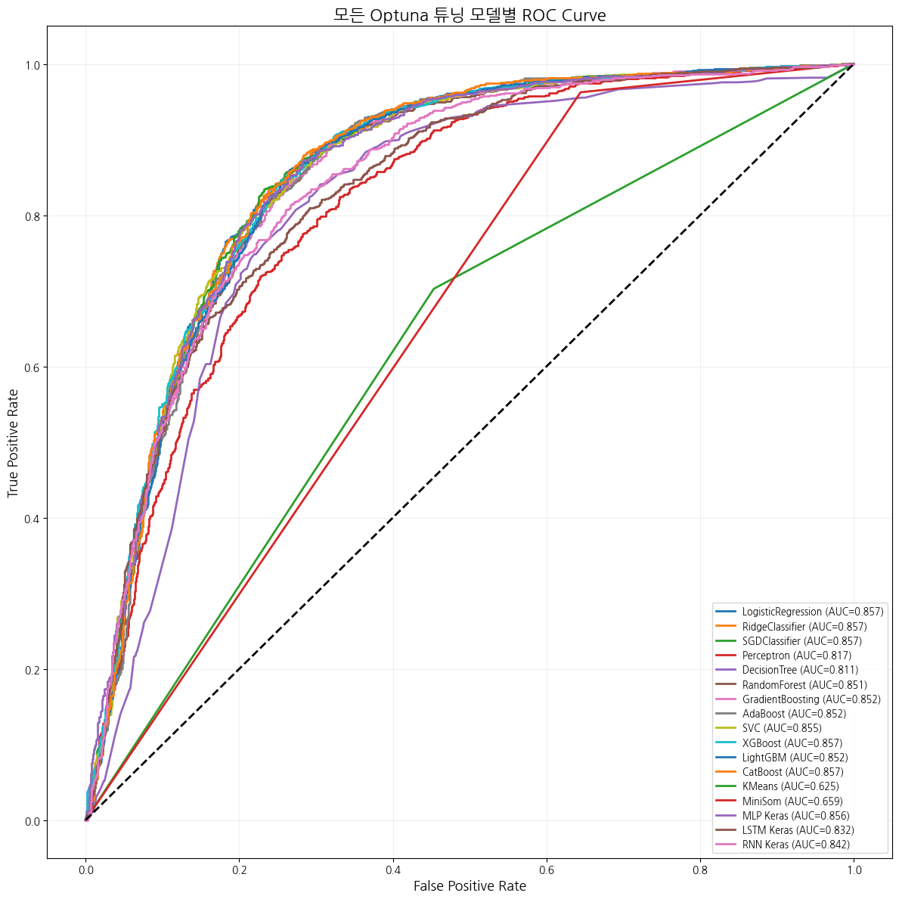

## 📌 SKN-AI-16-2 - 당원 이탈 예측 프로젝트

🧪 본 프로젝트는 가상의 당원 데이터를 활용하여,  
머신러닝 ,딥러닝기법을 통해 이탈 여부를 예측하고  
그 과정에서 데이터 분석 및 모델링 전반을 실습하며 학습하는 것을 목표로 하였습니다.

## 👥 팀원 소개

<table>
  <tr align="center">
    <td></td>
    <td></td>
    <td></td>
    <td></td>
    <td></td>
  </tr>
  <tr align="center">
    <td>김민정</td>
    <td>박상원</td>
    <td>신희석</td>
    <td>안주영</td>
    <td>원태식</td>
  </tr>
</table>

## 📅 업무 분담 일정표

| 8월 항목       | 1일(오전) | 1일(오후) | 2일(오전) | 2일(오후) | 3일(오전) | 3일(오후) | 4일(오전) | 4일(오후) | 5일(오전) | 5일(오후) | 6일(오전) |
|----------------|-----------|-----------|-----------|-----------|-----------|-----------|-----------|-----------|-----------|-----------|-----------|
| 도메인 분석    | ✅        | ✅        |     ✅       |     ✅       |           |           |           |           |           |           |           |
| 데이터 분석    |           |           | ✅        | ✅        | ✅        |     ✅       |           |           |           |           |           |
| 모델 분석      |           |           |     ✅       |     ✅       | ✅        | ✅        | ✅        |         |         |         |         |
| 설계           |           |           |           |      ✅      |      ✅      |      ✅      |      ✅       |            |            |            |           |
| 개발           |           |           |           |           |           |           |           |     ✅       |      ✅      |     ✅       |           |
| 테스트         |           |           |           |           |           |           |           |           |           |     ✅       |     ✅       |

## 🛠️ 기술 스택

| 구분             | 도구 및 라이브러리 |
|------------------|---------------------|
| 언어             |  |
| 인터페이스       |  |
| 데이터 처리      |   |
| 시각화           |   |
| 모델링 (ML) |           |
| 모델링 (DL) |    |
| 모델링 (Clustering) |   |
| 하이퍼파라미터 튜닝 |  |
| 기타             |    |

## 🔍 프로젝트 필요성 (배경)

조직(정당 또는 커뮤니티)에서는 당원의 유지율이 핵심 운영 지표가 됩니다.
그러나 많은 경우, 당원이 이탈하는 이유는 다양한 변수의 복합적인 영향으로 나타나며,
이를 사전에 예측하기 어렵습니다.
본 프로젝트는 이러한 문제를 데이터 기반으로 접근하여,
이탈 가능성이 높은 당원을 사전에 식별할 수 있는 예측 모델을 개발하고자 합니다.

## 🎯 프로젝트 목표

당원의 다양한 특성(소득, 직업, 가입기간 등)을 기반으로 이탈 여부 예측 모델 구축

머신러닝 기반 모델(CatBoost, XGBoost 등) 간의 성능 비교 및 최적화

피처 중요도 분석을 통해 주요 이탈 요인 도출

분석 결과를 통해 조직 유지율 향상을 위한 인사이트 제공

## 📄 데이터셋 정보
| No. | Column Name           | Non-Null Count | Dtype  | 설명 (선택)                           |
| --- | --------------------- | -------------- | ------ | --------------------------------- |
| 0   | MemberID              | 10000          | object | 회원 고유 ID                          |
| 1   | Age                   | 10000          | int64  | 나이                                |
| 2   | Gender                | 10000          | object | 성별                                |
| 3   | Region                | 10000          | object | 지역                                |
| 4   | Education             | 10000          | object | 교육 수준                             |
| 5   | Occupation            | 10000          | object | 직업                                |
| 6   | Income\_Decile        | 10000          | int64  | 소득 분위 (1\~10)                     |
| 7   | Income                | 10000          | object | 소득 범주                             |
| 8   | MembershipDuration    | 10000          | int64  | 가입 기간                             |
| 9   | MembershipType        | 10000          | object | 회원 유형                             |
| 10  | Primary\_Support      | 10000          | object | 주요 지지 정책                          |
| 11  | PoliticalActivity     | 10000          | int64  | 정치 활동 수준                          |
| 12  | PartyLoyalty          | 10000          | int64  | 당 충성도                             |
| 13  | PresidentApproval     | 10000          | int64  | 대통령 지지율                           |
| 14  | PolicySatisfaction    | 10000          | int64  | 정책 만족도                            |
| 15  | MediaConsumption      | 10000          | object | 주요 미디어 소비 채널                      |
| 16  | EventImpact           | 10000          | int64  | 특정 이벤트 영향 점수                      |
| 17  | PartyParticipation    | 10000          | int64  | 당 활동 참여 점수                        |
| 18  | FinancialContribution | 10000          | int64  | 정치 후원금                            |
| 19  | Churn                 | 10000          | int64  | 이탈 여부 (1 = 이탈)                    |
| 20  | **Date**              | 10000          | object | **데이터 수집 월 (2024-01 \~ 2025-07)** |

## 📊 수치형 변수 통계 요약
| 변수명                   | count   | mean    | std      | min  | 25%  | 50%  | 75%  | max    |
| --------------------- | ------- | ------- | -------- | ---- | ---- | ---- | ---- | ------ |
| Age                   | 10000.0 | 52.0493 | 16.8700  | 20.0 | 40.0 | 52.0 | 64.0 | 87.0   |
| Income\_Decile        | 10000.0 | 5.2784  | 2.5875   | 1.0  | 3.0  | 5.0  | 7.0  | 10.0   |
| MembershipDuration    | 10000.0 | 58.4032 | 60.4636  | 1.0  | 12.0 | 34.0 | 91.0 | 239.0  |
| PoliticalActivity     | 10000.0 | 2.2028  | 1.1335   | 1.0  | 1.0  | 2.0  | 3.0  | 5.0    |
| PartyLoyalty          | 10000.0 | 3.5716  | 0.8470   | 1.0  | 3.0  | 4.0  | 4.0  | 5.0    |
| PresidentApproval     | 10000.0 | 2.3837  | 1.0874   | 1.0  | 2.0  | 2.0  | 3.0  | 5.0    |
| PolicySatisfaction    | 10000.0 | 3.1481  | 0.7716   | 1.0  | 3.0  | 3.0  | 4.0  | 5.0    |
| EventImpact           | 10000.0 | 3.6861  | 1.0676   | 1.0  | 3.0  | 4.0  | 5.0  | 5.0    |
| PartyParticipation    | 10000.0 | 2.3022  | 1.3004   | 0.0  | 1.0  | 2.0  | 3.0  | 7.0    |
| FinancialContribution | 10000.0 | 54.5811 | 158.5193 | 0.0  | 0.0  | 5.0  | 45.0 | 2700.0 |
| Churn                 | 10000.0 | 0.4925  | 0.5000   | 0.0  | 0.0  | 0.0  | 1.0  | 1.0    |

### 🔹 ERD (Entity Relationship Diagram)

데이터베이스의 테이블 구조 및 변수 간 관계를 시각화한 다이어그램입니다.  
해당 ERD를 통해 어떤 데이터가 중심이 되는지, 어떤 변수들이 연관되어 있는지를 한눈에 파악할 수 있으며,  
모델 설계시 유용하게 활용되었습니다.

### 🔹 날짜별 중요 변수 통계
날짜별로 주요 변수(정책 만족도, 충성도, 이벤트 영향 등)의 평균 변화를 분석한 시각화입니다.  
특정 기간에 변수들이 급변한 구간은 이벤트 또는 외부 요인과의 연관성을 시사합니다.

### 🔹 상관관계 히트맵 (전체 변수)  
변수 간의 상관관계를 시각적으로 파악하여, Churn에 영향을 미치는 주요 변수들을 선별하는 데 사용했습니다.

### 🔹 Churn과의 개별 변수 상관관계  
Churn과 다른 변수 간의 상관관계를 정렬해 분석한 그래프입니다.  
정책 만족도, 당 충성도, 이벤트 영향도 등이 높은 상관을 보였습니다.

  
  

### 🔹 지역별 이탈률 시각화  
이탈률이 지역별로 얼마나 차이가 나는지를 시각화한 자료입니다.  
지역별 이탈률 차이를 통해 지역 특성을 반영한 전략이 필요함을 인식할 수 있습니다.

  
  

### 🔹 Churn 기준 분포 분석 3종
이탈자 기준으로 주요 변수 분포를 시각화한 그래프입니다.  
- 나이 분포: 중장년층(50~65대)의 이탈률이 높음  
- 가입 기간 분포: 가입 초기에 이탈률이 높음  
- 월 당 활동 참여 횟수: 활동 많은 당원은 이탈 확률 낮음

   
  
  

## 🖥️ Streamlit 기반 고객 이탈 예측 시스템

본 프로젝트는 **Streamlit**을 활용하여 사용자 친화적인 웹 인터페이스에서 고객 세그멘테이션 및 이탈 예측을 수행할 수 있도록 개발된 대시보드입니다.

### ✅ 주요 기능

- CSV 파일 업로드만으로 이탈 확률 예측
- 다양한 머신러닝 모델 선택 및 비교
- 피처 선택 기능 제공
- Optuna 기반 하이퍼파라미터 튜닝 가능
- 예측 결과 저장 및 다운로드
- 예측 히스토리 기록 기능 제공

---

### 🔹 예측 실행 화면

업로드한 고객 CSV 데이터를 기반으로 개별 이탈 확률을 예측합니다.  
모델 예측 결과는 테이블 형태로 표시되며, CSV 파일로 저장도 가능합니다.

  

---

### 🔹 모델 및 피처 설정 화면

사용자가 직접 사용할 예측 모델과 피처를 선택하고, 각 모델별 하이퍼파라미터를 조정할 수 있습니다.  
Optuna 튜닝 기능을 통해 최적의 성능을 가진 모델 구성이 가능합니다.

  

---

### 🔹 모델 예측 히스토리 화면

예측에 사용된 모델명, 피처, 성능 지표 (Accuracy, F1 Score, Precision, Recall) 를 자동으로 저장하며  
히스토리 테이블을 통해 모델 간 성능을 직관적으로 비교할 수 있습니다.

  

---
## 📊 모델별 성능 시각화

### 🔹 Random Forest

---

### 🔹 CatBoost

---

### 🔹 Gradient Boosting

---

### 🔹 Ridge Classifier

---

### 🔹 KNN (K=49)

---

### 📈 Optuna 튜닝 모델별 성능 비교

- 정확도(Accuracy) 및 ROC Curve를 통해 다양한 모델의 예측 성능을 평가했습니다.

  
  

